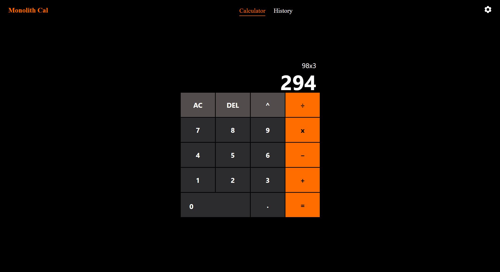
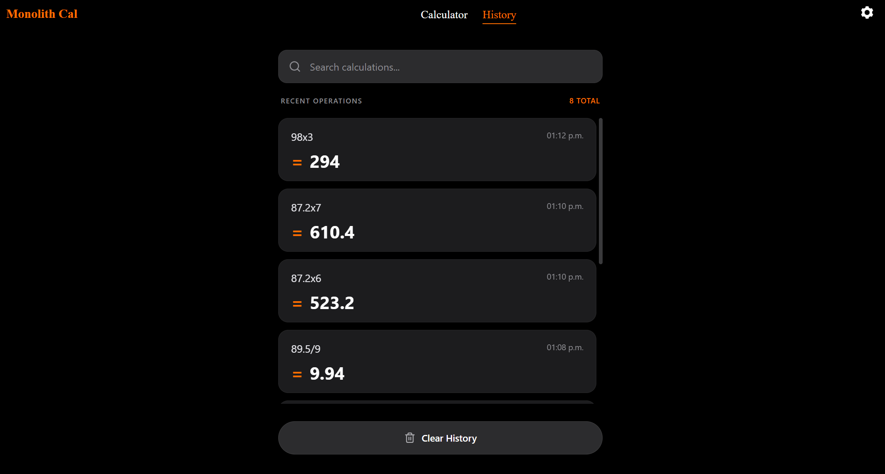

# Calculator

## Features
- Supported operations: addition (`+`), subtraction (`-`), multiplication (`x`), division (`/`), and power (`^`).
- Decimal numbers are supported with input validation (one decimal point per number).
- Each calculation is saved in the History page with expression, result, and time.
- History can be cleared using the **Clear History** button.

## Main Screen

## History

## Deleted history

